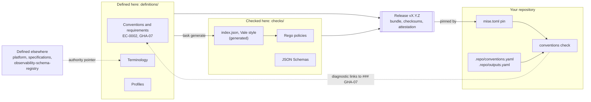

# Engineering conventions

`musher-dev/engineering-conventions` is the authoritative home for Musher's shared engineering language, repository
structures and implementation expectations. It defines the conventions, publishes the checks that validate them, and
releases both as a versioned bundle that other repositories pin. It does not run application code, and it does not
host CI for other repositories.

> **Status: v0, draft.** Every requirement is `proposed` at severity `warning`: a finding is advice, not a failure.
> The GitHub Actions conventions are derived from checks owned by `musher-dev/platform`, which stays their authority
> until a single handoff moves them here; where they differ from the platform, the difference is a proposal it adopts
> then ([decision 0002](docs/decisions/0002-authority-and-migration.md)).

## What a convention is

> **A convention is a published, versioned decision about how one part of a repository is named, structured or
> configured, written as requirements with permanent IDs that tools can check and people can cite.**

Each piece has one job:

| Piece | Example | What it is |
| --- | --- | --- |
| Topic | `github-actions` | The part of a repository the conventions govern, named for its files or tool |
| Convention | `EC-0002` Workflow files | A document that states related requirements and explains why |
| Requirement | `GHA-07` | One normative statement, with an ID that never changes or gets reused |
| Check | a Rego policy | Code that finds violations of a requirement |
| Diagnostic | `warning [GHA-07] …` | A finding in your repository, linking back to the requirement's heading |

For example, GHA-07 says *a workflow's name is its filename stem in Title Case*. A repository whose
`.github/workflows/validate.yml` says `name: CI` gets:

```text
warning [GHA-07] .github/workflows/validate.yml — name "CI" should be "Validate": a workflow's name is its filename stem in Title Case https://github.com/musher-dev/engineering-conventions/blob/main/engineering-conventions/definitions/conventions/github-actions/workflow-files.md#gha-07
```

If it helps, think of a **building code**:

| Building code | Here |
| --- | --- |
| The code book | The conventions |
| A numbered section of the code | A requirement, such as `GHA-07` |
| The inspector's checklist | The checks |
| The class of building (house, warehouse) | A convention profile, such as `base-repo` |
| The edition a permit cites | The release a repository pins |
| A granted variance, with an end date | A waiver in `.repo/conventions.yaml` |

A convention is **not** a template you copy (nothing here is applied to your repository), not a matter of taste (each
requirement names the failure it prevents), and not a definition of a word that another repository owns.

## How it fits together

What is decided lives in `definitions/`. What checks it lives in `checks/`. Both ship as one release, and each
repository pins a release and checks itself against it.



Inside the product directory, [`engineering-conventions/`](engineering-conventions/README.md), the layers are
directories: `definitions/` is decided, `checks/` validates, `examples/` shows a conforming repository, and `bin/` and
`src/` are the tooling that runs the checks. [How this repository is organized](docs/repository.md) says where every
file goes.

## Find a convention by what it governs

Start from the part of your repository you are working on:

| Topic | Governs in your repository | Conventions | Requirements |
| --- | --- | --- | --- |
| [Adoption](engineering-conventions/definitions/conventions/adoption/conventions-declaration.md) | The release pin in `mise.toml`, `.repo/conventions.yaml` | EC-0001 | ADOPT-01 – ADOPT-09 |
| [GitHub Actions](engineering-conventions/definitions/conventions/github-actions/README.md) | `.github/workflows/`, `.github/actions/` | EC-0002 – EC-0006 | GHA-01 – GHA-38 |
| [Outputs](engineering-conventions/definitions/conventions/outputs/README.md) | `.repo/outputs.yaml`, publish workflows | EC-0007, EC-0008 | OUT-01 – OUT-11 |

A topic's README gives the reading order. Two other ways in:

- **By ID.** A diagnostic names its requirement and links to the `### <ID>` heading, its permanent address. The
  generated [index of every ID](engineering-conventions/definitions/conventions/README.md) lists every one ever
  issued, retired ones included.
- **By machine.** `engineering-conventions/checks/data/index.json` holds every requirement with its title, status,
  severity, convention, path and anchor, plus the profiles and the vocabulary.

## What this repository owns, and what it doesn't

The rule of thumb: **it owns the rules about things, not the things.** Something can live here when many repositories
need the same answer and a check can cite it by ID. One repository's own rule stays in that repository, and a word
or format another repository defines gets a pointer, not a copy.

| Owned here | Not owned here |
| --- | --- |
| That a workflow that publishes is named `publish[-<scope>].yml` (GHA-02) | Your publish workflow, what it builds, when it runs |
| The format of `.repo/outputs.yaml` and what each output states (EC-0007) | The image, its registry, or a catalog that collects declarations |
| `validate` as a workflow token, and its banned synonyms `ci` and `checks` | Platform domain nouns, telemetry names, the customer glossary |
| The checks, and the release that ships them | Running them: your CI runs `conventions check` |
| What a waiver must state and how long it may last | Whether your repository needs one |

Where the rest lives:

| Not owned here | Owned by |
| --- | --- |
| How the company operates: rituals, planning, the operating model | `musher-dev/company` |
| Telemetry names: spans, metrics, attributes, events | `musher-dev/observability-schema-registry` |
| Document specifications: the component, blueprint and catalog formats | `musher-dev/specifications` |
| Positioning, product vocabulary, the customer glossary, platform domain nouns | `musher-dev/platform` and `musher-dev/company` |
| The development-container scaffold: the container, its toolchain setup, its stacks | `musher-dev/development-container` |
| Rules local to one repository | That repository |

A repository's own rule may be stricter than a convention here, never contradictory. The
[charter](docs/decisions/0000-charter.md) is the authority for this boundary.

## Using the conventions in another repository

Pin a release in `mise.toml` and run one command, the same locally and in CI:

```toml
[tools]
"github:musher-dev/engineering-conventions" = "0.3.0"  # x-release-please-version
```

```sh
conventions check
```

It prints a report grouped by requirement; `--output json` prints the findings for a program to read. mise verifies
the release's checksum and build provenance, and Renovate raises the pin. To try it without changing anything:

```sh
mise exec github:musher-dev/engineering-conventions@0.3.0 -- conventions check  # x-release-please-version
```

The details, and the path without mise, are in [Consuming the conventions](docs/consuming.md).

## Documentation

| Read | When you want to |
| --- | --- |
| [Consuming the conventions](docs/consuming.md) | adopt a release, declare outputs, read a diagnostic, add a waiver |
| [Authoring conventions](docs/authoring.md) | propose or change a requirement or a term |
| [Versioning](docs/versioning.md) | know what a release number promises |
| [How this repository is organized](docs/repository.md) | know where a file goes |
| [Decisions](docs/decisions/README.md) | understand why the repository works the way it does |

## Working on this repository

Open the repository in its dev container (or install the pinned tools with `mise`), then:

```sh
task setup     # install the pinned toolchain, the authoring CLI and the git hooks
task check     # every gate CI runs, except the dev container build
```

To add or change a requirement, read [Authoring conventions](docs/authoring.md) and [CONTRIBUTING.md](CONTRIBUTING.md).

## Releases

Releases are cut by release-please from Conventional Commit titles. Each `vX.Y.Z` release attaches the bundle
tarball, the `MusherConventions` Vale package, a manifest, `SHA256SUMS`, and a build-provenance attestation. The
version number says what an upgrade can break; see [Versioning](docs/versioning.md).

## Security

See [SECURITY.md](SECURITY.md) to report a vulnerability.
