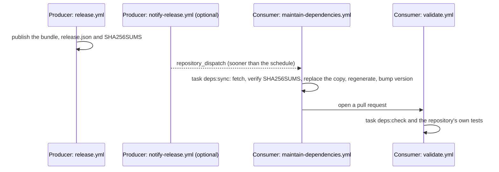

# Keeping dependencies current

A pin is only useful if something moves it. Without a routine, a consumer falls releases behind until an upgrade is a
project, and a producer cannot retire an old version because nobody knows who still reads it. This convention asks
each consumer for the same two tasks and one scheduled workflow, so every vendored dependency is verified on each
change and updated by a reviewed pull request after each release.

## Scope

This convention covers the tasks and workflows of a repository with a dependencies declaration
([EC-0032](dependencies-declaration.md)). It checks that they exist and run; the tasks' implementation is the
repository's. Packages and tools are kept current by Renovate or Dependabot, which read their manifests.

## Status and authority

This convention is a **draft** owned by this repository (`authority: self`), and its requirements are `proposed` at
severity `warning`
([decision 0022](https://github.com/musher-dev/engineering-conventions/blob/main/docs/decisions/0022-interfaces-and-dependencies.md)).

## The update flow



The schedule is the guarantee and a notification only makes it sooner, so a producer never has to list its
consumers. `maintain` is the workflow's responsibility: it changes the repository itself
([EC-0002](../github-actions/workflow-files.md)).

| Task | Does |
| --- | --- |
| `deps:check` | Offline: every vendored file against its release record, and code generated from a copy regenerated and compared. |
| `deps:sync` | For each dependency, or one named: fetch the latest release, verify it against its `SHA256SUMS`, replace the copy with the declared interfaces' files and the record, regenerate, and set `version`. |

## Requirements

### DEPS-08

**A repository that vendors dependencies defines `deps:check` and `deps:sync`.**

The same two names in every consumer let a person, a hook or a workflow verify and update vendored copies without
reading the repository's Taskfile, and let one scheduled workflow shape work everywhere. A task counts when
`task <name>` runs it from the root.

**Correct:**

```yaml
includes:
  deps: taskfiles/deps.Taskfile.yml     # defines check and sync
```

**Incorrect:**

```yaml
tasks:
  api:vendor:check: …                   # a name only this repository uses
```

Checked by: conftest · Severity: warning · Since: 0.7.0

### DEPS-09

**A validate workflow runs `deps:check`.**

A vendored copy edited by hand, or left half-updated, must not merge. DEPS-05 and DEPS-06 see the bytes when the
conventions run; `deps:check` also proves the code generated from them is current, which only the repository's own
tooling can do.

**Correct:**

```yaml
# .github/workflows/validate.yml
      - run: task deps:check
```

**Incorrect:**

```yaml
# .github/workflows/validate.yml
      - run: task test                  # nothing verifies the vendored copies
```

Checked by: conftest · Severity: warning · Since: 0.7.0

### DEPS-10

**A scheduled `maintain-dependencies` workflow runs `deps:sync`.**

A release that no consumer picks up is a release that never reaches production. A scheduled workflow picks up each
release even when its producer sends no notification, and opens one pull request per update so the change is
reviewed and tested like any other. The finding is reported on the declaration when the workflow is missing, and on
the workflow when it has no schedule or does not run `deps:sync`.

**Correct:**

```yaml
# .github/workflows/maintain-dependencies.yml
on:
  schedule: [{ cron: "17 6 * * 1-5" }]
  repository_dispatch: { types: [dependency-released] }
  workflow_dispatch:
jobs:
  sync:
    steps:
      - run: task deps:sync
```

**Incorrect:**

```yaml
# .github/workflows/release-api-pin.yml   # not a maintain workflow, and on dispatch only
on:
  repository_dispatch: { types: [platform-api-released] }
```

Checked by: conftest · Severity: warning · Since: 0.7.0

## References

- [EC-0032 Dependencies declaration](dependencies-declaration.md)
- [EC-0002 Workflow files](../github-actions/workflow-files.md)
