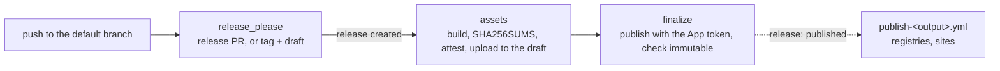

# Release workflows

The release configuration ([EC-0024](release-configuration.md)) decides what a release is; the release workflow is
where it happens. Every release goes through the same run: release-please opens the release pull request and, once it
is merged, creates the tag and a draft release; a job builds and attaches the assets while the release is still a
draft; a last job publishes it. After that, the release is immutable ([REL-14](release-tags.md#rel-14)), and nothing
writes to it again.



A package registry or a site is published by a separate `publish-<output>.yml` or `deploy-<output>.yml` triggered by
`release: published`. Those workflows read the release; they never write to it.

## Scope

This convention governs every workflow under `.github/workflows/` and composite action under `.github/actions/` that
runs release-please, mints a token in `release.yml`, or uploads to, publishes or deletes a GitHub Release. REL-19
applies when the release-please config drafts releases ([REL-07](release-configuration.md#rel-07)).

## Status and authority

This convention is a **draft** owned by this repository (`authority: self`), and every requirement is `proposed` at
severity `warning`. [Decision 0017](https://github.com/musher-dev/engineering-conventions/blob/main/docs/decisions/0017-releases-from-drafts.md)
records the choices. Two requirements elsewhere apply to the same workflow and are not repeated here:
[GHA-47](../github-actions/releases-and-deployments.md#gha-47) (release-please never runs with the default token) and
[GHA-48](../github-actions/releases-and-deployments.md#gha-48) (the last jobs run unless the run is cancelled).

## Requirements

### REL-15

**Only `release.yml` runs release-please, on a push, in a concurrency group that never cancels.**

Two workflows running release-please race: each opens or updates the release pull request, and each may create the
same release. One workflow, named for its responsibility ([GHA-02](../github-actions/workflow-files.md#gha-02)), is
where a reader looks. It runs on a push to the default branch, which is when release-please has something to do: a
merge that updates the release pull request, or a merged release pull request to tag. And it is never cancelled,
because a run cancelled between creating the tag and publishing the release leaves a half-made release to reconcile by
hand. The check reports a release-please step in any other workflow, and a `release.yml` that runs release-please
without a `push` trigger or without a workflow-level concurrency group whose `cancel-in-progress` is `false`.

**Correct:**

```yaml
# release.yml
on:
  push:
    branches: [main]
concurrency:
  group: ${{ github.workflow }}-${{ github.ref }}
  cancel-in-progress: false
```

**Incorrect:**

```yaml
# release-pr.yml, beside a tag-triggered release.yml
on:
  push:
    branches: [main]
```

Checked by: conftest · Severity: warning · Since: 0.6.2

### REL-16

**The release workflow mints its tokens from the release App, scoped to what each job needs.**

The organization releases through one GitHub App, identified by the organization variable `RELEASE_APP_CLIENT_ID`
and the secret `RELEASE_APP_PRIVATE_KEY`. One App means one bypass actor on every tag ruleset
([REL-13](release-tags.md#rel-13)) and one place to rotate a key. `actions/create-github-app-token` names an App by
`client-id`; `app-id` is its older input. Each job asks only for the permissions it uses (`permission-contents`,
`permission-pull-requests`), so a token that leaks from a job can do only that job's work. The check reports an App
token step in `release.yml` that uses another `client-id` or `private-key`, uses `app-id`, or requests no
`permission-*` input.

**Correct:**

```yaml
- name: Mint the release App token
  id: app_token
  uses: actions/create-github-app-token@<sha>  # v3
  with:
    client-id: ${{ vars.RELEASE_APP_CLIENT_ID }}
    private-key: ${{ secrets.RELEASE_APP_PRIVATE_KEY }}
    permission-contents: write
    permission-pull-requests: write
```

**Incorrect:**

```yaml
- uses: actions/create-github-app-token@<sha>  # v3
  with:
    app-id: ${{ secrets.AUTOMATION_APP_ID }}
    private-key: ${{ secrets.AUTOMATION_APP_PRIVATE_KEY }}
```

Checked by: conftest · Severity: warning · Since: 0.6.2

### REL-17

**Nothing writes to a release once it is published.**

A workflow triggered by `release` runs after the release is published, when an immutable release rejects every
change to its assets; an upload there fails, and in a repository without immutability it silently changes bytes
consumers already verified. Deleting a release is worse: consumers pinned it, and its tag can never be reused. Attach
assets to the draft in `release.yml` ([REL-19](#rel-19)) and fix a bad release with the next version. The check
reports a step in a workflow triggered by `release` that uploads, creates, edits or deletes a release (`gh release`,
`gh api` writes to `releases`, or an action that attaches files), and `gh release delete` anywhere.

**Correct:**

```yaml
# publish-sdk.yml
on:
  release:
    types: [published]
jobs:
  npm:
    steps:
      - run: npm publish --provenance
```

**Incorrect:**

```yaml
# publish.yml
on:
  release:
    types: [published]
jobs:
  assets:
    steps:
      - run: gh release upload "$TAG" dist/*
```

Checked by: conftest · Severity: warning · Since: 0.6.2

### REL-18

**A job that uploads release assets attests them through a `SHA256SUMS` file.**

A consumer verifies a download two ways: its digest against the release's `SHA256SUMS`, and its build provenance with
`gh attestation verify` or mise, which checks attestations by default. One file name across the organization means one
verification command. `actions/attest` with `subject-checksums` attests every file `SHA256SUMS` lists in one
attestation, and needs `id-token: write` to sign it and `attestations: write` to store it. The check reports a job that
uploads release assets without an `actions/attest` (or `actions/attest-build-provenance`) step whose
`subject-checksums` names a `SHA256SUMS` file, and a job that attests that way without both permissions.

**Correct:**

```yaml
permissions:
  contents: write
  id-token: write
  attestations: write
  artifact-metadata: write
steps:
  - run: (cd dist && sha256sum -- * > SHA256SUMS)
  - uses: actions/attest@<sha>  # v4
    with:
      subject-checksums: dist/SHA256SUMS
  - run: gh release upload "$TAG" dist/*
```

**Incorrect:**

```yaml
steps:
  - run: gh release upload "$TAG" dist/*.tar.gz
```

Checked by: conftest · Severity: warning · Since: 0.6.2

### REL-19

**A draft release is published last, with the release App's token.**

When release-please drafts releases ([REL-07](release-configuration.md#rel-07)), a draft stays invisible until
something publishes it, and a draft nobody publishes is a release that never happened. Publishing is the last step,
after every asset is attached, because from then on the release is immutable. And the release App publishes it: a
release published with the default `GITHUB_TOKEN` starts no workflow on its `published` event, so every
`publish-<output>.yml` that waits for it never runs. The check reports a config that drafts releases when no workflow
publishes a draft (`gh release edit --draft=false`, or `gh api` with `draft=false`), and a publishing step whose
`GH_TOKEN` is missing or is the default token.

**Correct:**

```yaml
- name: Publish the draft release
  env:
    GH_TOKEN: ${{ steps.app_token.outputs.token }}
  run: gh release edit "$TAG" --draft=false
```

**Incorrect:**

```yaml
- name: Publish the draft release
  env:
    GH_TOKEN: ${{ github.token }}
  run: gh release edit "$TAG" --draft=false
```

Checked by: conftest · Severity: warning · Since: 0.6.2

### REL-20

**A release workflow that attaches assets can be dispatched to finish a draft.**

"Re-run failed jobs" repeats a run with the workflow file it started with, so a draft left behind by a bug in the
workflow cannot be completed by re-running it once the bug is fixed. A `workflow_dispatch` trigger with a required
`tag` input runs the fixed workflow for that draft. The dispatched run completes only a draft and refuses a published
release, which it could not change anyway. The check reports a `release.yml` that uploads release assets and has no
`workflow_dispatch` trigger with a `tag` input; whether the run refuses a published release is reviewed.

**Correct:**

```yaml
on:
  push:
    branches: [main]
  workflow_dispatch:
    inputs:
      tag:
        description: The tag of a draft release to finish, such as v1.2.3.
        required: true
        type: string
```

**Incorrect:**

```yaml
on:
  push:
    branches: [main]
```

Checked by: conftest · Severity: warning · Since: 0.6.2

## References

- [GitHub Docs: Immutable releases](https://docs.github.com/en/code-security/supply-chain-security/understanding-your-software-supply-chain/immutable-releases)
- [GitHub Docs: GITHUB_TOKEN](https://docs.github.com/en/actions/concepts/security/github_token)
- [actions/create-github-app-token](https://github.com/actions/create-github-app-token)
- [actions/attest](https://github.com/actions/attest)
- [release-please-action](https://github.com/googleapis/release-please-action)
- [EC-0023 Releases and deployments](../github-actions/releases-and-deployments.md)
